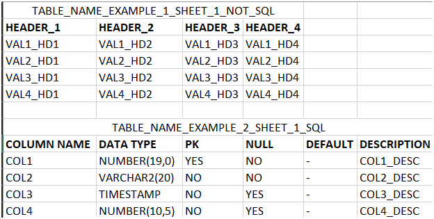

# Excel → JSON / CSV / SQL

Small desktop app (Tkinter) that extracts **tables** from Excel workbooks and exports them as **JSON**, **CSV**, and/or **Oracle DDL (SQL)**.  
Tables are detected by a **header pattern** you define in the UI.


---

## What it does

- Open an **.xlsx** workbook and scan **selected sheets**.
- Detect one or more **tables per sheet** based on a header row you specify.
- Parse each table into structured data (`table_name`, `header`, `rows`, `sheet`, `start_cell`).
- Export:
  - **JSON**: one file with all parsed tables.
  - **CSV**: one file per table.
  - **SQL (DDL)**: one file per table (+ `_ALL_TABLES.sql`) with `CREATE TABLE`, `PRIMARY KEY`, and `COMMENT` statements.
- Assign an **Oracle schema per sheet** (or use a default) for the SQL.

**Requirements & Python version**  
Check `.python-version` and `requirements.txt`.

---

## How detection works

1. The app searches each sheet for a **consecutive row** whose cells match your **Header Pattern** (case/spacing-insensitive).
2. The **table name** is read from the **row above** the header (merged cells supported). If absent, the **sheet name** is used.
3. Data rows are read **downwards** until:
   - an **empty row** is found (if **Stop on empty row** is enabled), or
   - another **header pattern** is encountered (start of a new table).

Example of a recognized table:



---

## GUI — Fields and actions

### 1) Source Excel


- **Path** — choose the `.xlsx` to process.  
- **Load Sheets** — loads sheet names into the list.

### 2) Header Pattern (defines table start)


Set the frame (format: `col_a, col_b, …`) — type the exact header labels **in order**, separated by commas.  
Example (see `./data/EXAMPLE_EXCEL.xlsx`): COLUMN NAME, DATA TYPE, PK, NULL, DEFAULT, DESCRIPTION, COMMENTS


### 3) Output

This section has two sub frames:

#### a) Format


- **JSON** — writes `tables.json` containing all parsed tables.  
- **CSV** — writes one CSV per table into `out/.../csv/`.  
- **SQL (DDL)** — writes one `.sql` per table into `out/.../sql/` and `_ALL_TABLES.sql`.  
- **Stop on empty row** — if enabled, the parser stops a table at the first empty row within the header span.

#### b) Directory


Choose where to write `json/`, `csv/`, and `sql/`.

### 4) Sheets & Schemas


- **List of sheets** — select the sheets to process (none selected = **all** sheets).  
- **Schema per sheet** — optional text field for each sheet. The app builds a map `{sheet → schema}`; blank entries use the first non-blank schema you typed, or fallback `MYSCHEMA`.

### 5) Run / Quit


- **Run** — launches parsing and exports according to your selections.  
- **Quit** — closes the app.

---

## Running the app

From a terminal in the app folder:

```bash
python -m venv .venv
# macOS/Linux
source .venv/bin/activate
# Windows
# .\.venv\Scripts\Activate.ps1
pip install --upgrade pip
pip install -r requirements.txt  # or: pip install openpyxl
python app_gui.py
```

---

## Typical flow

1) Click Browse… and choose your Excel.
2) Click Load Sheets.
3) Enter the Header Pattern (comma-separated).
4) Select sheets (optional).
5) Fill schemas (optional; leave blank to use default).
6) Select export formats and output folder.
7) Click Run.

---

## Troubleshooting

### “No tables found with the given header pattern.”
- Check header labels: they must match exactly after trimming each token (case/spacing is normalized).
- Verify you included all header columns and correct order.
- If tables have empty spacer rows, try unchecking Stop on empty row.

### Wrong table name
- The app reads the row above the header (merged cells supported). If blank, it falls back to the sheet name.

### SQL errors in Oracle
- Ensure DATA TYPE values in Excel are valid Oracle types (e.g., VARCHAR2(50), NUMBER(10,2), DATE, TIMESTAMP(6)).
- If you need strict date/timestamp defaults, add TO_DATE/TO_TIMESTAMP formatting in ddl_module.py.

### Long names truncated
- Oracle identifiers are limited to 30 chars; the app truncates after sanitization.

---

## Known limitations

- Detection assumes headers are contiguous and in a single row.
- Stops at the first empty row within the header span (if enabled).
- Does not infer data types from sample values—relies on the Excel DATA TYPE column.